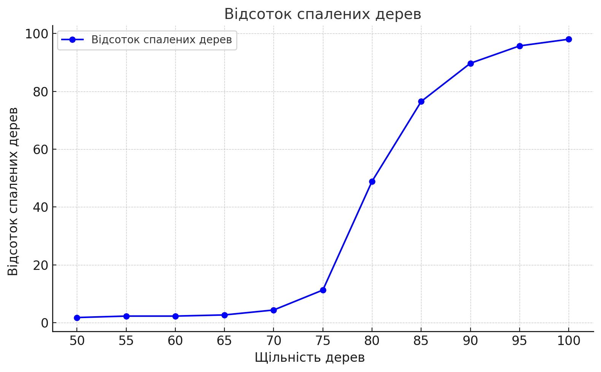
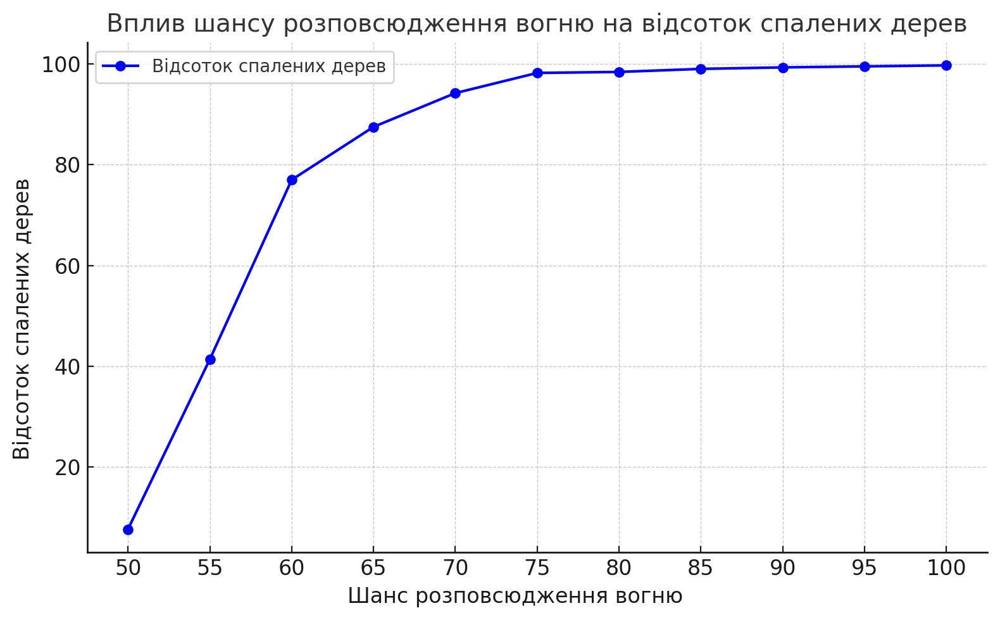
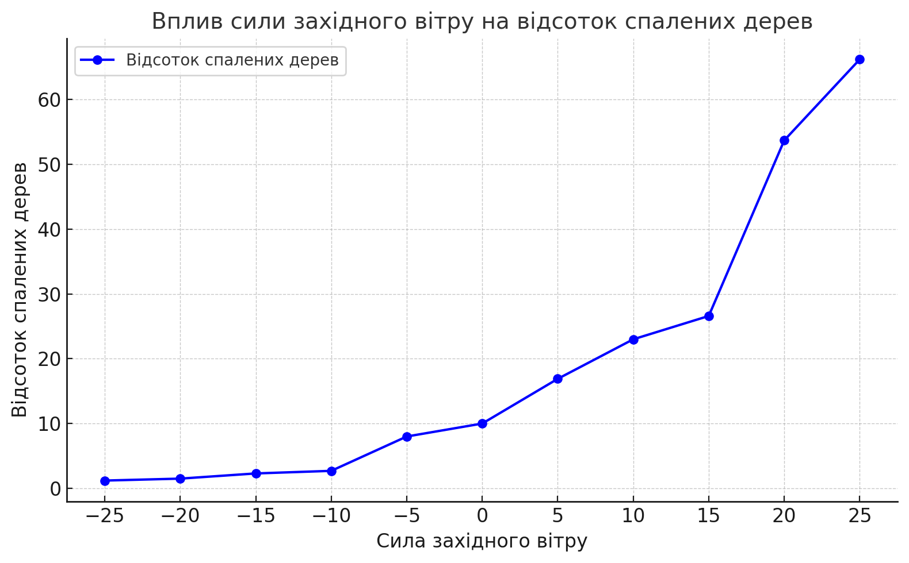

# Лабораторна робота №1  
**Опис імітаційних моделей та проведення обчислювальних експериментів**  
**Група:** СПм-23-5  
**Автор:** Холобок Владислав Іванович 

## Модель: **Fire Simple Extension 2**  
Посилання на модель: [NetLogo Fire Simple Extension 2](http://www.netlogoweb.org/launch#http://www.netlogoweb.org/assets/modelslib/IABM%20Textbook/chapter%203/Fire%20Extensions/Fire%20Simple%20Extension%202.nlogo)  

### Опис моделі  
Ця модель імітує поширення пожежі в лісі з урахуванням густоти дерев та впливу вітру. Вогонь стартує з лівого краю лісу і поширюється у чотирьох напрямках: північ, схід, південь і захід. Модель демонструє, як невеликі зміни параметрів можуть суттєво вплинути на динаміку системи, а також показує наявність критичних точок (нелінійний поріг).

### Керуючі параметри:  
- **density** – густота дерев у лісі.  
- **probability-of-spread** – ймовірність поширення вогню між сусідніми ділянками.  
- **south-wind-speed** – сила південного вітру (негативне значення – північний вітер).  
- **west-wind-speed** – сила західного вітру (негативне значення – східний вітер).  

### Внутрішні параметри:  
- **initial-trees** – кількість дерев у моделі.  

### Показники роботи моделі:  
- **percent burned** – відсоток згорілих дерев.  

### Недоліки моделі:  
1. Пожежа завжди починається з лівого краю лісу, що не враховує можливість різних точок займання.  
2. Ландшафт надто спрощений: відсутні галявини, водойми чи ділянки з різною щільністю дерев.  

---

## Обчислювальні експерименти  

### 1. Вплив густоти дерев на поширення пожежі  
**Мета:** Дослідити залежність між густотою дерев і відсотком згорілих дерев.  
- **Параметри експерименту:**  
  - **density:** від 50% до 100%, крок 5%.  
  - Інші параметри:  
    - **probability-of-spread:** 57%  
    - **south-wind-speed:** 25  
    - **west-wind-speed:** 25  
<table>
<thead>
<tr><th>Щільність дерев</th><th>Відсоток спалених дерев</th></tr>
</thead>
<tbody>
<tr><td>50</td><td>1.8</td></tr>
<tr><td>55</td><td>2.3</td></tr>
<tr><td>60</td><td>2.3</td></tr>
<tr><td>65</td><td>2.7</td></tr>
<tr><td>70</td><td>4.4</td></tr>
<tr><td>75</td><td>11.3</td></tr>
<tr><td>80</td><td>48.9</td></tr>
<tr><td>85</td><td>76.5</td></tr>
<tr><td>90</td><td>89.7</td></tr>
<tr><td>95</td><td>95.7</td></tr>
<tr><td>100</td><td>98.0</td></tr>
</tbody>
</table>

**Результати:**  
Зі збільшенням густоти дерев частка згорілих дерев суттєво зростає. Критична точка починається з густоти ~80%, після чого пожежа охоплює більшу частину лісу.

---

### 2. Вплив ймовірності поширення вогню  
**Мета:** Визначити, як ймовірність поширення впливає на розмір ураженої ділянки.  
- **Параметри експерименту:**  
  - **probability-of-spread:** від 50% до 100%, крок 5%.  
  - Інші параметри:  
    - **density:** 82%  
    - **south-wind-speed:** 25  
    - **west-wind-speed:** 25  
  
<table>
<thead>
<tr><th>Шанс розпосюдження вогню</th><th>Відсоток спалених дерев</th></tr>
</thead>
<tbody>
<tr><td>50</td><td>7.7</td></tr>
<tr><td>55</td><td>41.4</td></tr>
<tr><td>60</td><td>77.0</td></tr>
<tr><td>65</td><td>87.5</td></tr>
<tr><td>70</td><td>94.2</td></tr>
<tr><td>75</td><td>98.2</td></tr>
<tr><td>80</td><td>98.4</td></tr>
<tr><td>85</td><td>99.0</td></tr>
<tr><td>90</td><td>99.3</td></tr>
<tr><td>95</td><td>99.5</td></tr>
<tr><td>100</td><td>99.7</td></tr>
</tbody>
</table>

**Результати:**  
При ймовірності поширення понад 75% більшість дерев у лісі згорає, а подальше збільшення цього параметра мало впливає на результат.

---

### 3. Вплив сили вітру на поширення пожежі  
**Мета:** Дослідити, як сила західного/східного вітру впливає на поширення пожежі.  
- **Параметри експерименту:**  
  - **west-wind-speed:** від -25 до 25, крок 5.  
  - Інші параметри:  
    - **density:** 82%  
    - **probability-of-spread:** 57%  
    - **south-wind-speed:** 25  
<table>
<thead>
<tr><th>Сила західного вітру</th><th>Відсоток спалених дерев</th></tr>
</thead>
<tbody>
<tr><td>-25</td><td>1.2</td></tr>
<tr><td>-20</td><td>1.5</td></tr>
<tr><td>-15</td><td>2.3</td></tr>
<tr><td>-10</td><td>2.7</td></tr>
<tr><td>-5</td><td>8.0</td></tr>
<tr><td>0</td><td>10.0</td></tr>
<tr><td>5</td><td>16.9</td></tr>
<tr><td>10</td><td>23.0</td></tr>
<tr><td>15</td><td>26.6</td></tr>
<tr><td>20</td><td>53.7</td></tr>
<tr><td>25</td><td>66.2</td></tr>
</tbody>
</table>

**Результати:**  
Східний вітер має слабкий вплив, тоді як західний вітер значно прискорює поширення пожежі.

